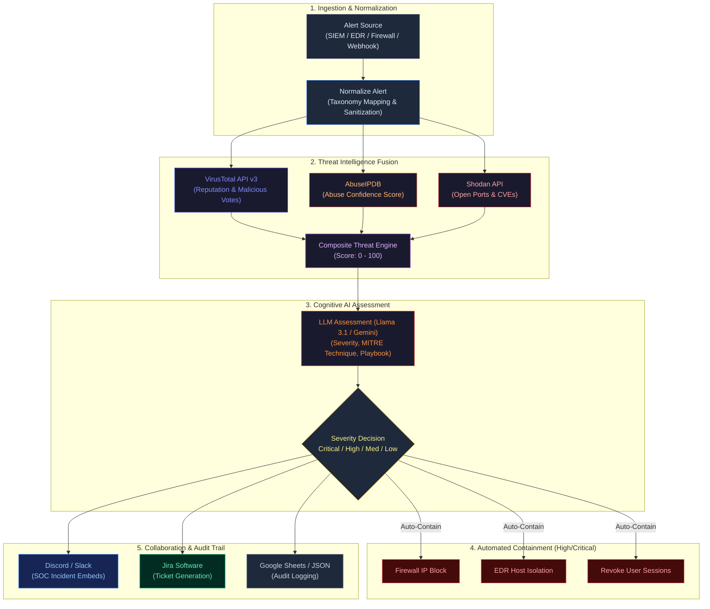

<div align="center">

#  SentinelFlow

### Autonomous AI-Powered Security Operations & Incident Response (SOAR) Pipeline

[](https://python.org)
[](https://n8n.io/)
[](https://www.virustotal.com/)
[](https://www.abuseipdb.com/)
[](https://www.shodan.io/)
[](https://groq.com/)
[](LICENSE)

<br/>

**SentinelFlow cuts through alert fatigue by automating Tier-1 triage, multi-source threat intelligence fusion, AI reasoning, and high-severity containment — accelerating incident response from minutes to sub-10 seconds.**

<br/>

[Key Highlights](#-key-highlights) • [Architecture](#-architecture) • [Workflow Engines](#-two-ways-to-run) • [Getting Started](#-getting-started) • [Configuration](#-configuration) • [Research & Citation](#-research--academic-citation) • [License](#-license)

</div>

---

##  Key Highlights

- **Multi-Source Threat Fusion** — Real-time correlation with **VirusTotal API v3**, **AbuseIPDB**, and **Shodan** to establish a weighted **Composite Threat Score (0–100)**.
- **Guarded LLM Reasoning** — Utilizes **Groq Llama 3.1** / **Google Gemini** / **Claude** with strict JSON schema parsing for deterministic severity classification and playbook recommendations.
- **Automated Containment Actions** — Executes policy-driven incident containment: Firewall IP blocking, EDR host isolation, and active session/token revocation.
- **Full SOC Integration** — Instant notification dispatch to **Discord** and **Slack**, automated ticket creation in **Jira Software**, and audit logging in **Google Sheets**.
- **NIST & MITRE ATT&CK Aligned** — Normalizes alerts against standard taxonomy (Brute Force, C2, Malware, Exfiltration) following the **NIST SP 800-61r2** incident handling lifecycle.
- **Dual Engine Flexibility** — Deploy as a **visual low-code n8n workflow** or run as a **high-speed standalone Python CLI engine**.

---

## Architecture



---

## Project Structure

```
SentinalFlow/
├── .env.example                               # Pre-configured environment template
├── .gitignore                                 # Git ignore filters
├── CODE_OF_CONDUCT.md                         # Community guidelines
├── CONTRIBUTING.md                            # Contribution instructions
├── LICENSE                                    # MIT License
├── README.md                                  # Project documentation
├── SECURITY.md                                # Vulnerability reporting policy
├── requirements.txt                           # Core dependencies
│
├── docs/
│   ├── architecture.md                        # Deep technical specification
│   └── presentation/
│       └── SentinelFlow_PoC_Presentation.pptx # Project defense slides & diagrams
│
├── src/                                       # Python micro-service engine
│   ├── __init__.py                            # Module exports
│   ├── config.py                              # Configuration & environment loader
│   ├── enrichment.py                          # VirusTotal API v3 integration
│   ├── analyzer.py                            # Groq Llama 3.1 analysis & JSON parser
│   ├── notifier.py                            # Discord webhook embed formatter
│   └── sentinel_flow.py                       # CLI orchestrator & pipeline runner
│
├── tests/
│   └── test_sentinel_flow.py                  # Unit and integration test suite
│
└── workflows/                                 # Ready-to-import n8n pipelines
    ├── n8n_incident_response_soar.json        # Full SOAR Pipeline (VT, AbuseIPDB, Jira, Slack, Containment)
    └── sentinel_flow.json                     # Lightweight Rapid-Triage Workflow
```

---

## Two Ways to Run

### Option 1: Full Enterprise SOAR Workflow (n8n)

The complete end-to-end orchestration pipeline is available under `workflows/`:

1. Launch your self-hosted **n8n** instance (`npx n8n` or via Docker).
2. Go to **Workflows → Import from File** and select:
   ```
   workflows/n8n_incident_response_soar.json
   ```
3. Set your environment variables in n8n or link your credentials:
   - `VIRUSTOTAL_API_KEY`
   - Slack, Jira, or Google Sheets credentials as needed.
4. Activate the **Receive Security Alert** Webhook node to begin accepting live security events.

---

### Option 2: Standalone Python Micro-Engine

For lightweight environments, scripts, or serverless functions:

#### 1. Clone & Set Up Environment

```bash
# Clone repository
git clone https://github.com/itold1lie/SentinalFlow.git
cd SentinalFlow

# Create virtual environment
python -m venv venv
source venv/bin/activate       # On Windows: venv\Scripts\activate

# Install dependencies
pip install -r requirements.txt
```

#### 2. Configure Credentials

```bash
# Create local .env from template
cp .env.example .env
```

Edit `.env` with your API keys:

```ini
VT_API_KEY=your_virustotal_api_key_here
GROQ_API_KEY=your_groq_api_key_here
DISCORD_WEBHOOK_URL=https://discord.com/api/webhooks/your_webhook_url
```

#### 3. Execute the Engine

```bash
python -m src.sentinel_flow
```

---

## Sample Output

```
============================================================
 SENTINELFLOW — AUTONOMOUS SECURITY TRIAGE PIPELINE
============================================================

--- PROCESSING ALERT #1: google.com ---
 Alert Ingested: ID=ALERT-9281, Target=google.com
  ├─ VirusTotal: 0 malicious, 0 suspicious (Clean)
  ├─ AI Assessment: Severity=Low (Confidence: 98%)
  └─ Decision: Pass (No action needed)

--- PROCESSING ALERT #2: testphp.vulnweb.com ---
 Alert Ingested: ID=ALERT-9282, Target=testphp.vulnweb.com
  ├─ VirusTotal: 3 malicious engines detected
  ├─ AI Assessment: Severity=High
  ├─ MITRE Technique: T1190 (Exploit Public-Facing Application)
  ├─ Containment: Mock IP firewall block triggered
  └─ Dispatch: Discord embed & Jira incident ticket created

============================================================
 TRIAGE COMPLETE: 2 Alerts Processed in 2.34s
============================================================
```

---

## Threat Taxonomy & MITRE ATT&CK Mapping

SentinelFlow standardizes raw incoming events into recognized security categories:

| Alert Category | MITRE Technique | Recommended Playbook | Default Action |
|---|---|---|---|
| **BRUTE_FORCE** | `T1110` (Brute Force) | Identity Lockout Playbook | Revoke Sessions & Flag User |
| **MALWARE_DETECTED** | `T1204` (User Execution) | Endpoint Isolation Playbook | Quarantine Host via EDR |
| **C2_COMMUNICATION** | `T1071` (App Layer Protocol) | Network Egress Filter Playbook | Block IP at Firewall |
| **DATA_EXFILTRATION** | `T1048` (Exfiltration Over Alt Protocol) | DLP Containment Playbook | Emergency Access Cutoff |
| **WEB_ATTACK** | `T1190` (Exploit Public-Facing App) | WAF Rule Enforcement | Rate-Limit & Block Origin IP |

---

## Security Policy & Credential Hygiene

- **Zero Committed Secrets**: This repository strictly rejects hardcoded API keys, bearer tokens, or webhook secrets. All configurations utilize `.env` variables or n8n secret stores.
- **Safe Simulation**: Out-of-the-box containment actions default to mock endpoints to protect production networks during initial testing.
- Please review our [SECURITY.md](SECURITY.md) for vulnerability disclosure procedures.

---

## Research & Academic Citation

This project is built upon the academic research:

> **"SentinelFlow: AI + N8N Workflows for Security Operations"**    
> **Authors:** Lakshan Kumaresh V D, Rithish S, Loga Mummoorthi S  
> **Team:** ZERO TWO  

If you use SentinelFlow in your research or SOC deployment, please cite this repository:

```bibtex
@article{sentinelflow2026,
  title={SentinelFlow: AI + N8N Workflows for Security Operations},
  author={Lakshan Kumaresh V D and Rithish S and Loga Mummoorthi S }
```

---

##  Contributors

- **Lakshan Kumaresh V D** ([@itold1lie](https://github.com/itold1lie)) — *Architecture, Automation & Core Pipeline*

---

## License

This project is licensed under the [MIT License](LICENSE).
