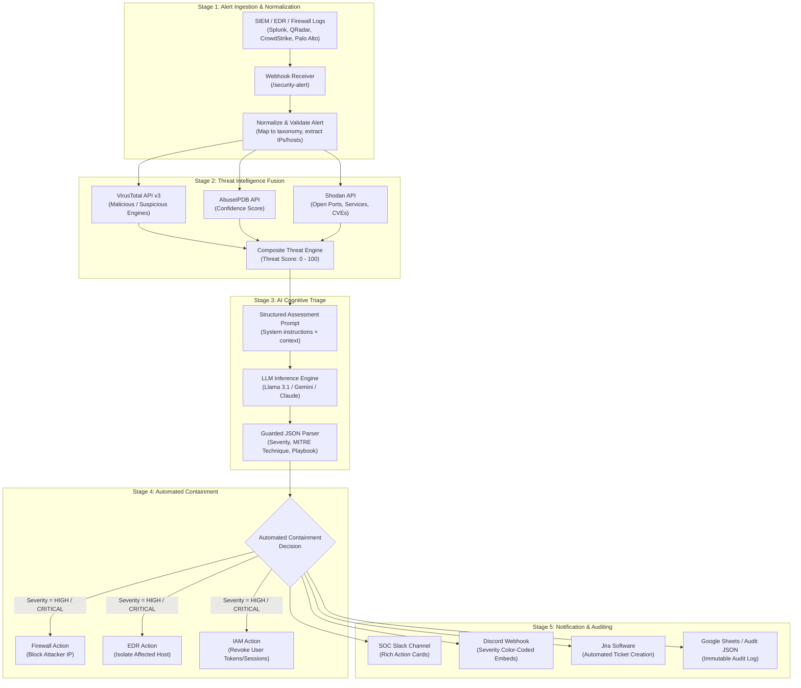

# SentinelFlow Architecture Specification

## 1. System Overview

SentinelFlow is an autonomous Security Operations Center (SOC) incident response and triage framework. It was designed to address alert fatigue by automating the ingestion, enrichment, AI-driven assessment, containment, and notification lifecycle of security alerts.

The system is deployed in two complementary modalities:
1. **Enterprise SOAR Pipeline (`workflows/n8n_incident_response_soar.json`)**: An end-to-end, visual, low-code orchestration workflow hosted on n8n that links SIEM/EDR webhooks, VirusTotal, AbuseIPDB, Shodan, LLM assessment (Google Gemini / Claude), automated containment endpoints, Slack, Jira, and Google Sheets.
2. **High-Speed Python Micro-Engine (`src/`)**: A modular Python CLI and service engine connecting VirusTotal API v3 and Groq's Llama 3.1 inference for rapid, sub-second alert triage with Discord embeds.

---

## 2. End-to-End SOAR Workflow Pipeline



---

## 3. Threat Intelligence & Scoring Formula

SentinelFlow fuses signals from three distinct intelligence sources to produce a normalized **Composite Threat Score (0–100)**:

$$\text{Composite Score} = \min\left(100, S_{\text{VT}} + S_{\text{Abuse}} + S_{\text{Shodan}}\right)$$

Where:
- **$S_{\text{VT}}$ (Max 40 points)**:
  $$\left(\frac{\text{Malicious Votes}}{\text{Total Engines}}\right) \times 40$$
- **$S_{\text{Abuse}}$ (Max 35 points)**:
  $$\left(\frac{\text{Abuse Confidence Score}}{100}\right) \times 35$$
- **$S_{\text{Shodan}}$ (Max 25 points)**:
  $$\min\left(25, |\text{CVEs}| \times 5 + |\text{Open Ports}| \times 0.5\right)$$

This multi-factor weighting ensures that false positives from single engines are buffered, while confirmed malicious activity across multiple providers immediately triggers containment.

---

## 4. Structured LLM Output Contract

The AI engine guarantees a strictly typed JSON response schema:

```json
{
  "severity": "CRITICAL | HIGH | MEDIUM | LOW | INFORMATIONAL",
  "severityScore": 88,
  "confidence": 0.94,
  "summary": "High-confidence brute force attack followed by lateral movement indicators.",
  "recommendedPlaybook": "COMPROMISED_CREDENTIALS_CONTAINMENT",
  "mitreTechniques": [
    "T1110.001 - Password Guessing",
    "T1078 - Valid Accounts"
  ],
  "iocList": [
    "198.51.100.45",
    "malicious-payload-drop.xyz"
  ],
  "immediateActions": [
    "Block source IP 198.51.100.45 at edge firewall",
    "Revoke active Okta sessions for affected user",
    "Isolate workstation WS-FIN-088"
  ],
  "autoContainmentAuthorized": true
}
```

---

## 5. Containment Safety Gates

Automated containment actions execute under strict safety constraints:
1. **Mock Fallback**: In non-production testing environments, containment endpoints point to sandboxed mocks.
2. **Allowlist Safeguard**: RFC 1918 private subnets and essential DNS/gateway addresses are excluded from automated firewall IP blocks.
3. **Audit Trail**: Every automated action records a timestamp, triggering incident ID, target asset, and initiating rule for post-incident review.
